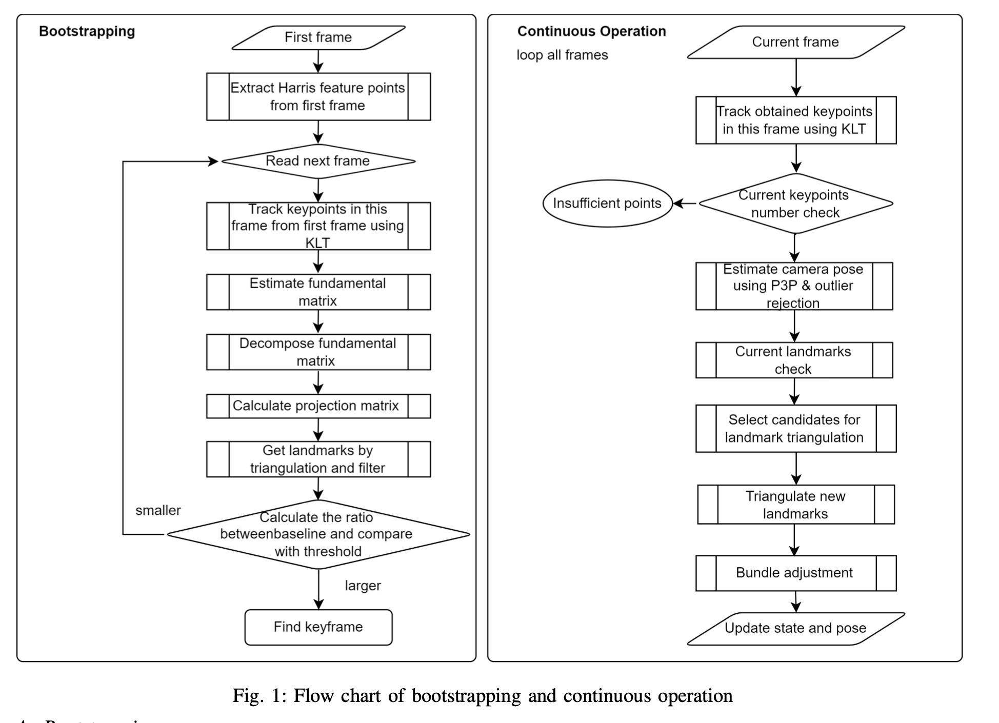
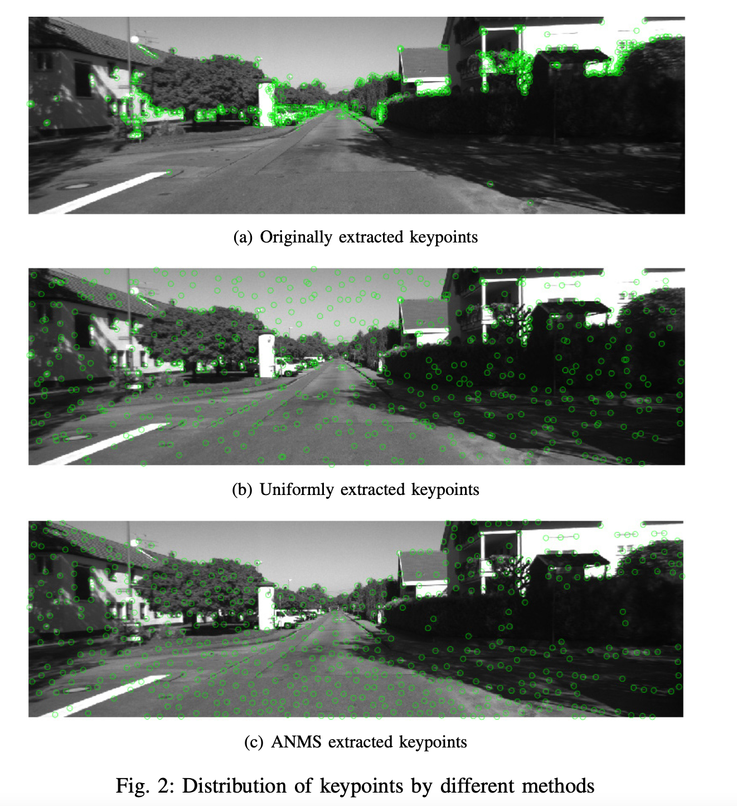
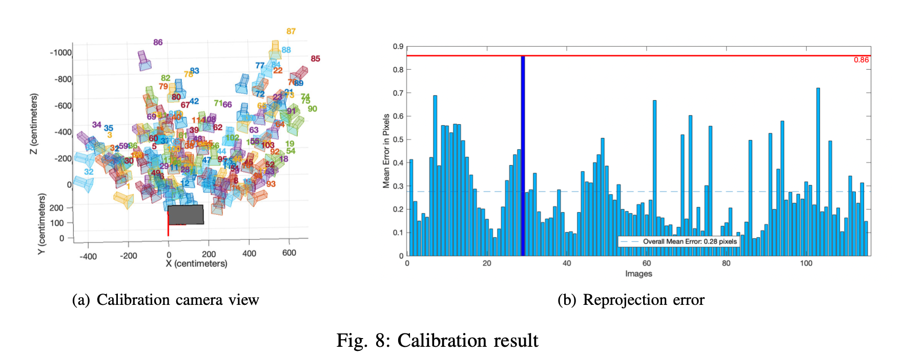
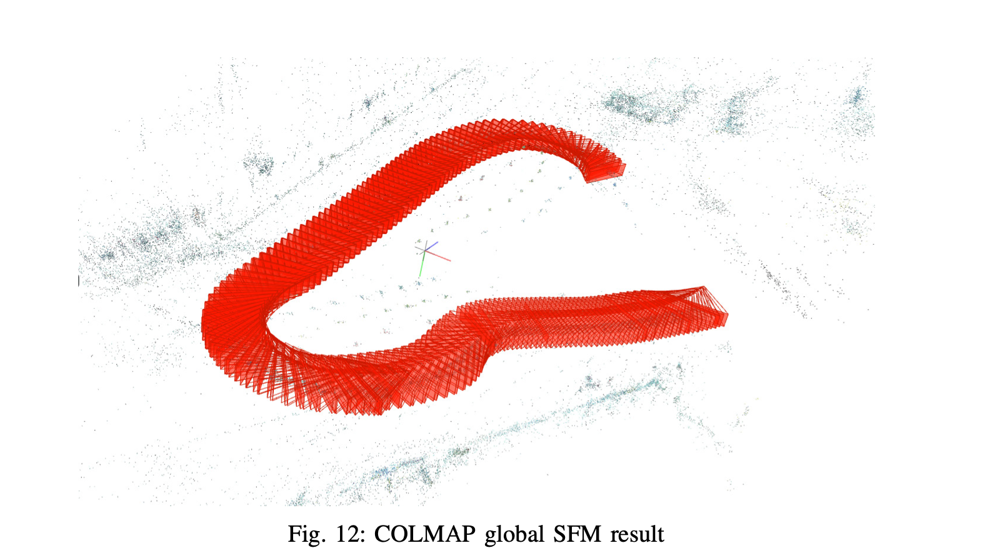

In this repository we show the full grade mini project of course Vision Algorithm for mobile robots. 
Due to the confidentiality of the code we only show the statement and report here. If you are interested in more detail, feel free to contact me email: qimaqi@ethz.ch
Grade: 0.5/0.5

# Introduction
This project aims to build a monocular visual odometry pipeline, consisting of bootstrapping and continuous operations. We implement and then test our pineline on the three provided datasets: KITTI, Malaga and parking. Additionally, we adopt this pinepine on our AMZ racing dataset. Despite some challenges, we compare the results of two tracking method: direct method and feature-based method. Further discussion and idea about the results are provided in the end. Our pineline results are available at this link:[Mini Project Pipeline](https://www.youtube.com/playlist?list=PL2MUcB-2O2qRZe6FLm6mnGhllfENG2qd-).

 

- **Bootstrapping**
    - **Keypoints extraction**
    - **KLT tracking**
    - **Fundamental matrix estimation and decomposition**
    - **Linear triangulation**
    - **Keyframe selection**

he purpose of the bootstrapping part is to find a appropriate keyframe so that we can utilise the initial frame and the keyframe found to generate 3D landmarks which are applied in the continuous operation section after bootstrapping. The whole procedure of the bootstrapping is illustrated in the left part of Figure 1.

1) Keypoints extraction: we first use Harris corner detector to extract the keypoints from the initial frame. In order to get high score and uniformly in frame distributed keypoints, we adopt an adaptive non-maximal suppression algorithm [1] to filter extracted keypoints. The details of this algorithm are demonstrated in the chapter Experiment and result.

 

2) KLT tracking: KLT is used to track the keypoints among the frames by comparing a pixel with other pixels in a certain large window to find the most similar pixel, which allows tracking trajectories in real time. The prerequisites for the good performance of KLT algorithm are brightness constancy, temporal consistency and spatial coherency. By using this algorithm, we can track the keypoints from the first frame in its following frames quickly.

3) Fundamental matrix estimation and decomposition: With the keypoints from two different frames, we can estimate the fundamental matrix. In the pipeline, we adopt least median of squares method, which at least 50% of the points should be inliers in both frames. After acquiring the fundamental matrix, we can decompose it to find the relative motion between two frames. Since two rotation matrices and two transition vectors are obtained during the decomposition, we have to find the right rotation and translation based on the inliers.

4) Linear triangulation: Since intrinsic matrix is known, the projection matrix for both two frames can be calculated with the estimated rotation matrix and transition vector. Therefore, the position of 3D landmarks can be calculated by linear square approximation and optimized by minimizing the reprojection errors.

5) Keyframe selection: After obtaining the landmarks and the baseline, we calculate the ratio between the average depth of the landmarks and the length of the baseline. We set a threshold and once the ratio surpasses the threshold, this frame is chosen as the keyframe and meanwhile the bootstrapping part is terminated. The value of the threshold depends on the scenario and needs to be tuned.

- **Continuous Operation**
    - **KLT tracking**
    - **Pose and triangulation refinement**
    - **Current landmarks check**
    - **Candidates selection for triangulation**
    - **Bundle adjustment**

After bootstrapping, the pipeline processes new frames sequentially. This part in general take previous state, previous image and current image as input, and output the current state and camera pose. To achieve this, newly tracked keypoints is associated to existing landmarks, followed by pose estimation with 3D-2D correspondences, and meanwhile triangulating new landmarks. The process is shown in Figure 1.

1) KLT tracking: The tracking part is the same as in bootstrapping. The three provided datasets all meet the prerequisite of KLT well. With the help of coarse-to-fine estimation, sufficient keypoints are tracked along the trajectory.

2) Pose and triangulation refinement: P3P, requiring only 3 points and another one for disambiguation, allows outlier rejection with less iterations. Though it is suggested in the project statement that the afterwards DLT solution may be worse than the best P3P guess, we find it not true for our pipeline. The comparison between P3P with refinement and P3P only is shown in Figure 3, without refinement it often leads to losing track. Thus, we use P3P with refinement in all of our experiments later. Furthermore, we add refinement to triangulation to minimize the sum of reprojection errors.

3) Current landmarks check: In every step of continuous operation, existing keypoints are matched against new frame. Previous keypoints that are not tracked in the new frame are removed in the state vector. Besides, we have to check if the landmarks corresponding to the keypoints are still in front of the image plane. Another reprojection factor is introduced to remove landmarks that are too far away compared to the current average landmarks depth, since they include large depth uncertainty.

4) Candidates selection for triangulation: It is necessary to continuously add new landmarks since invalid ones are being removed every step. We implement this by taking notes of the track length of each keypoint candidate. As soon as the angle between corresponding keypoint vectors exceed the angle threshold, we triangulate this keypoint candidate and get a new landmark candidate. We calculate reprojection errors of obtained candidates, those with reprojection errors larger than the threshold is also removed.

5) Bundle adjustment: Bundle adjustment is crucial in this task since it solves the underlying non-linear least- squares problem [2]. In our pipeline we run global bundle adjustment at first when total frames is limited and switch to sliding window bundle adjustment in later tracking for computation saving purpose.

In addition to the basic work, we also do many interesting explorations. We use our self-developed visual odomertry on customized dataset racing dataset and also run it on Colmap to see the performance of global SFM.

 

In this part we implement the Zhang’s calibration method. We collect the data with a big Checkerboard which has 25cm square length. In order to match the actual competition scene we take videos from multiple angles and also cover long distances like Figure above. We use the Camera Calibrator application from Matlab and as the Figure 9 shows, all frames reprojection error are smaller than 1 pixel therefore the calibration is good.

 

In order to verify the effect of global SFM, we use the COLMAP for custom dataset. The trajectory is locally right and obviously the loop is not closed due to shift of SFM. Therefore loop closure is essential.

[1] Oleksandr Bailo, Francois Rameau, Kyungdon Joo, Jinsun Park, Oleksandr Bogdan, and In So Kweon. Efficient adaptive non-maximal suppression algorithms for homogeneous spatial keypoint distribution. Pattern Recognition Letters, 106:53–60, 2018.

[2] Christian Forster, Zichao Zhang, Michael Gassner, Manuel Werlberger, and Davide Scaramuzza. Svo: Semidirect visual odometry for monocular and multicamera systems. IEEE Transactions on Robotics, 33(2):249–265, 2016.